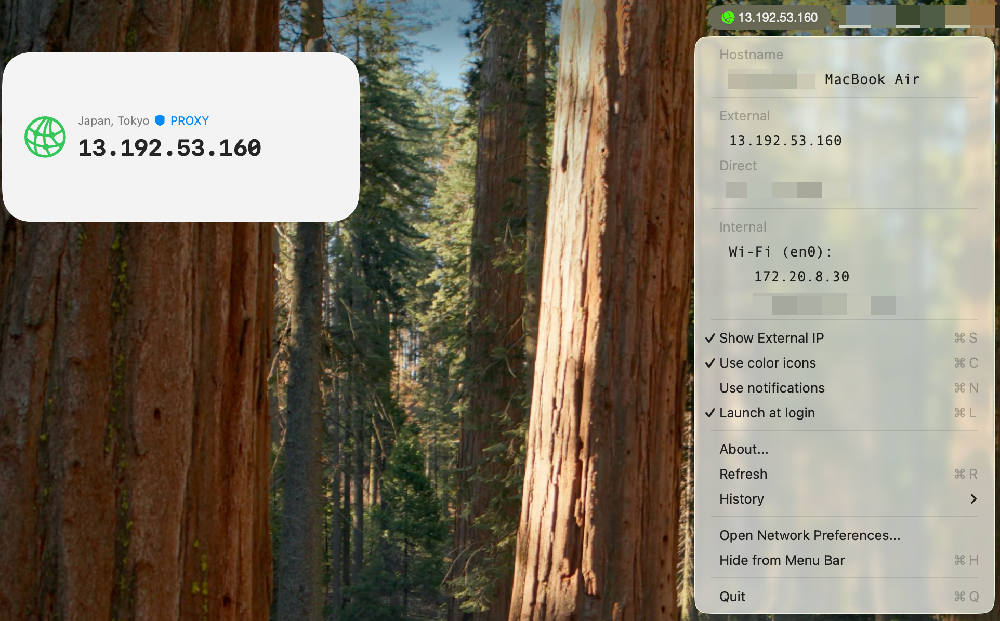

# MyIP

一个简洁的 macOS 菜单栏工具，实时显示您的网络状态和 IP 地址信息。

## 功能特性

- 🌐 显示外网和内网 IP 地址
- 🛡️ 智能检测代理状态
- 📊 实时监控网络连接状态
- 🔔 网络状态变化时发送系统通知
- 🎨 支持彩色和黑白图标主题
- 📱 支持 macOS Widget 扩展
- 📍 显示物理位置地图
- 🖥️ 识别虚拟网卡所属应用

## 截图



## 系统要求

- macOS 11.0 或更高版本
- Xcode 26.x 或更高版本（开发）

## 安装

下载最新版本的 [MyIP.dmg](./build/release/MyIP.dmg) 文件，双击安装即可。

## 使用说明

### 基本功能
- 点击菜单栏图标查看详细网络信息
- 应用会自动检测网络状态变化
- 支持开机自启动

## 项目结构

```
MyIP/
├── MyIP/                    # 主应用代码
│   ├── AppDelegate.swift    # 应用主入口
│   ├── Network.swift        # 网络功能核心
│   ├── NetworkMonitor.swift # 网络状态监控
│   ├── Settings.swift       # 设置管理
│   └── Assets.xcassets/     # 应用资源
├── MyIPWidget/              # Widget 扩展
├── build/                   # 构建产物
└── create-dmg.sh            # 构建脚本
```

## 开发

### 技术栈
- Swift 5.0+
- Cocoa Framework
- Network.framework
- CoreLocation
- WidgetKit
- UserNotifications

### 核心组件
- **Network.swift**: 处理 IP 地址获取和网络检测
- **NetworkMonitor.swift**: 监控网络状态变化
- **AppDelegate.swift**: 应用生命周期和菜单栏交互

## 许可证

本项目基于 [MIT License](LICENSE) 开源。

## 致谢

本项目基于 [IPConnect](https://github.com/pawong/IPConnect) 开源项目开发。进行了大幅重构和功能扩展，代码量增长 86.5%，新增 Widget 支持、网络监控增强、内存安全优化等现代化改进。
